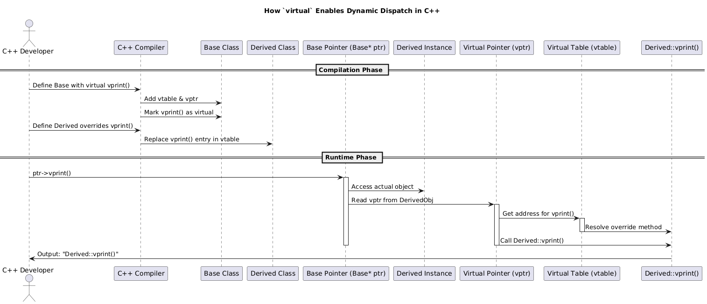
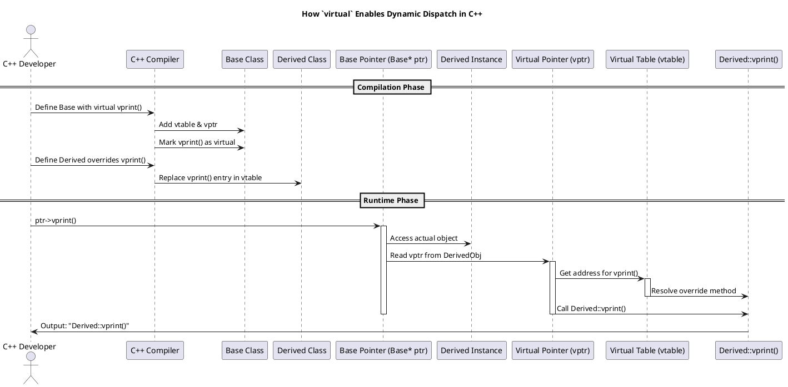

### Sequence Diagram



---

### C++ Code Example: Virtual vs Non-Virtual Behavior

```cpp
#include <iostream>
using namespace std;

class Base {
public:
    void print() {
        cout << "Base::print (non-virtual)" << endl;
    }

    virtual void vprint() {
        cout << "Base::vprint (virtual)" << endl;
    }
};

class Derived : public Base {
public:
    void print() {
        cout << "Derived::print (non-virtual override)" << endl;
    }

    void vprint() override {
        cout << "Derived::vprint (virtual override)" << endl;
    }
};

int main() {
    Base* ptr = new Derived();

    ptr->print();   // Calls Base::print (STATIC dispatch)
    ptr->vprint();  // Calls Derived::vprint (DYNAMIC dispatch via vtable)

    delete ptr;
    return 0;
}
```

---

### PlantUML Sequence Diagram Code (matching above)



---


### Summary

| Feature         | `print()`                     | `vprint()`                      |
|----------------|-------------------------------|---------------------------------|
| Static/Dynamic | Static (compile-time)         | Dynamic (runtime via vtable)    |
| Behavior       | Calls `Base::print`            | Calls `Derived::vprint`         |
| Requires `virtual` | ❌ No                          | ✅ Yes                           |

