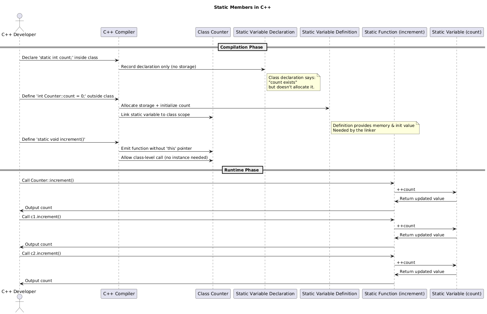
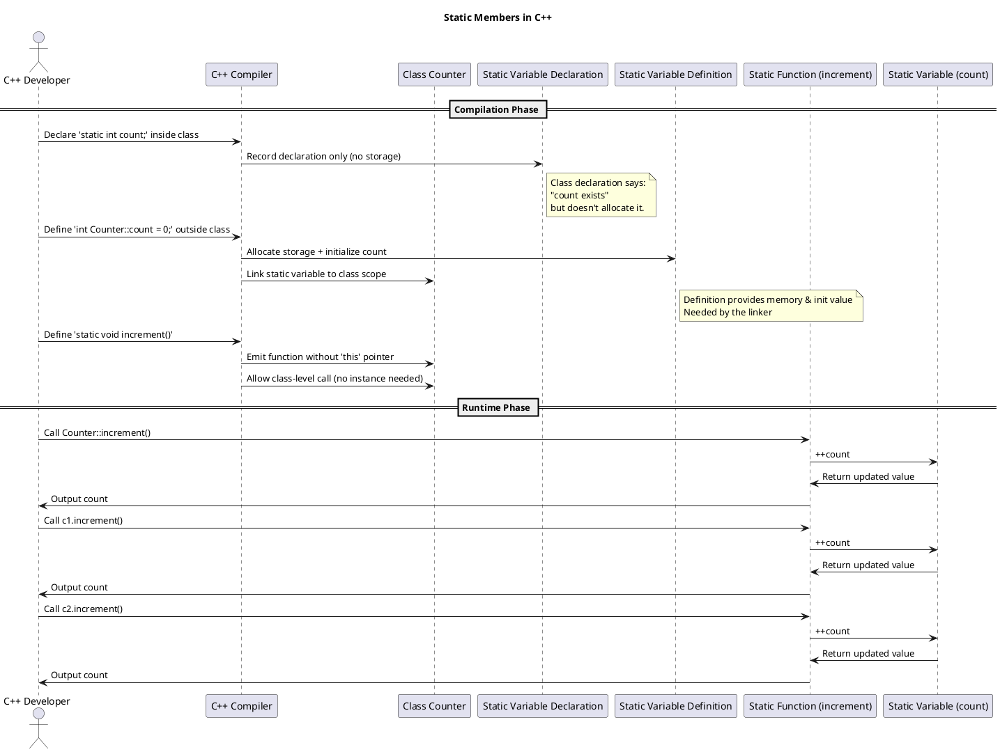

## Static member variable and Static member function

### Sequence Diagram Static member variable and member function



---

### Cpp code
``` cpp
#include <iostream>
using namespace std;

class Counter {
private:
    static int count; // static member variable

public:
    static void increment() { // static member function
        ++count;
        cout << "Count: " << count << endl;
    }
};

// Define the static variable outside the class
int Counter::count = 0;

int main() {
    Counter::increment(); // No object needed
    Counter::increment();

    Counter c1, c2;
    c1.increment();  // Still calls the same static method
    c2.increment();  // Count shared across all
    return 0;
}

```

---

## Notes

### Why are we defining the count variable again outside the class?
Great question! You're asking about this line:

```cpp
int Counter::count = 0;
```

This is **necessary in C++** for **static class members**. Let’s break it down:

---

### ✅ Why Do We Define `count` Outside the Class?

When you write this in a class:

```cpp
class Counter {
    static int count;
};
```

You are **declaring** `count`—you’re telling the compiler:  
> “There exists a `static int` named `count` that belongs to this class.”

However, **that declaration alone doesn't allocate storage** for `count`. It’s like saying *“a global variable exists”* without creating it.

So you must **define** it in exactly **one** translation unit like this:

```cpp
int Counter::count = 0;
```

This line:
- **Allocates memory** for the `count` variable.
- **Initializes it** to `0`.
- Tells the linker where the actual variable lives.

---

### 🧠 Why Not Inside the Class?

Because static members are **shared across all instances**, C++ separates their memory from instance objects. Including it in the class definition would:
- Cause ambiguity (is it per-instance or per-class?).
- Violate the ODR (**One Definition Rule**) if multiple definitions exist in different translation units.

---

### 🆚 Instance vs Static Member Initialization

```cpp
class Example {
    int regular = 1;           // Fine (C++11 and above)
    static int shared = 1;     // ❌ Not allowed here!
};
```

To initialize `shared`, you must do it like this:

```cpp
int Example::shared = 1; // Outside the class
```

---

### 🔥 Bonus: C++17 Inline Static Members

Since **C++17**, you can do this directly inside the class:

```cpp
class Counter {
    inline static int count = 0; // ✅ Storage + initialization in one place
};
```

### ✅ 1. What `static` Means in C++

#### A. Inside a class (static member function or variable)
- Belongs to the **class itself**, not any instance.
- No `this` pointer.
- Accessible without creating an object.
- Memory is shared across all objects.

#### B. At file scope (global `static`)
- Limits **visibility to the translation unit** (file-level linkage).

#### C. Inside a function
- Retains its value between function calls (**persistent state**).

---

### 🧠 What Happens Behind the Scenes

#### Compiler Responsibilities:
- Allocates a **single shared memory location** for `count`.
- Ensures `increment()` is callable without an object.
- No `this` pointer is passed to `increment()`.

#### Runtime Behavior:
- Calls to `increment()` modify the **same memory**.
- Output increases with each call.

---

### 🧩 Uses of the `static` Keyword

| Context              | Meaning                                                                 |
|----------------------|-------------------------------------------------------------------------|
| **Class member**     | Shared among all instances (e.g., counters, constants)                  |
| **Member function**  | Can be called without an object, doesn't access instance members        |
| **Inside a function**| Retains value across multiple calls                                     |
| **File scope**       | Restricts symbol visibility to the current file                         |


---

### PUML syntax


