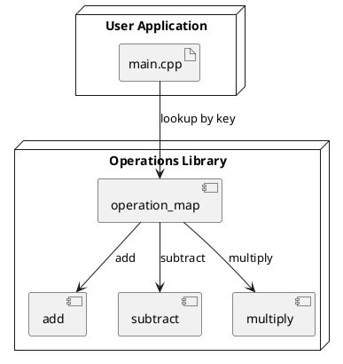

# Function pointers in C++
### 🌟 **Problem Statement**
Suppose you have different operations (e.g., `add`, `subtract`, `multiply`) and want to dynamically decide **at runtime** which function to invoke. Without function pointers, this often leads to verbose conditional logic.

---

## 🔧 **1. Without Function Pointer**

### 🔹 **C++ Code (Without Function Pointer)**
```cpp
#include <iostream>
using namespace std;

int add(int a, int b) { return a + b; }
int subtract(int a, int b) { return a - b; }

int main() {
    int choice = 1;
    int result;

    if (choice == 1)
        result = add(5, 3);
    else
        result = subtract(5, 3);

    cout << "Result: " << result << endl;
    return 0;
}
```

### ❗ **Limitation**
- Scalability issue: every new operation requires modifying the `if-else` or `switch` logic.
- Tight coupling of logic and decision structure.

---

## ✅ **2. With Function Pointer**

### 🔹 **C++ Code (With Function Pointer)**
```cpp
#include <iostream>
using namespace std;

int add(int a, int b) { return a + b; }
int subtract(int a, int b) { return a - b; }

int main() {
    int (*operation)(int, int); // function pointer
    int choice = 1;

    if (choice == 1)
        operation = add;
    else
        operation = subtract;

    int result = operation(5, 3);
    cout << "Result: " << result << endl;
    return 0;
}
```

### ✅ **Benefit**
- **Flexible** and **extensible**: easier to manage many operations.
- Enables **callbacks** and **strategy patterns**.
- Useful in plugin architectures, runtime selection, and embedded systems.

---
# Question
## Even with function pointers we are using if-else what is the actual benefit we are gaining from this?

Even with **function pointers**, if you're still using `if-else` or `switch` to select the function at runtime, **you haven't fully eliminated the hard-coded decision logic**. The real win comes when you pair function pointers with **data structures like maps or arrays**, or pass them around **as arguments** to decouple logic.

## ✅ Better Approach with Function Pointers + `std::map`

Here’s a **scalable** and **extensible** version using a map:

### 🔧 **Improved C++ Code**
```cpp
#include <iostream>
#include <map>
using namespace std;

int add(int a, int b) { return a + b; }
int subtract(int a, int b) { return a - b; }
int multiply(int a, int b) { return a * b; }

int main() {
    // Map operation names to function pointers
    map<string, int(*)(int, int)> operations;
    operations["add"] = add;
    operations["subtract"] = subtract;
    operations["multiply"] = multiply;

    string choice = "multiply"; // dynamically chosen
    int a = 5, b = 3;

    if (operations.find(choice) != operations.end()) {
        int result = operations[choice](a, b);
        cout << "Result: " << result << endl;
    } else {
        cout << "Invalid operation!" << endl;
    }

    return 0;
}
```

### ✅ **Benefits**
- **No need to modify control flow logic** for new functions.
- Just insert a new entry in the `map`.
- Dynamic operation dispatching — cleaner and more maintainable.

---

## 🗂 Deployment Diagram (Improved Function Pointer with Map)



---

# Advanced - To Do

Would you like a version with `std::function` or a more OOP-style like Strategy Pattern? Those take it even further.

Would you like me to simulate the layout in a PlantUML memory diagram? Or maybe dive into how this relates to virtual functions or std::function?

---