Below is an **expert-level** yet **beginner-friendly** guide to the **Gang of Four (GoF) Design Patterns** in C++, reorganized by **Creational**, **Structural**, and **Behavioral** categories with **new numbering** that makes it clear which pattern belongs to which category. Each pattern section includes:

1. **Concept Explanation** (in simple terms).  
2. **Real-World Analogy** (helps internalize why the pattern is used).  
3. **Use Case** (when/why to use).  
4. **C++ Concepts Demonstrated** (e.g., encapsulation, inheritance, polymorphism).  
5. **UML Diagram** (using Mermaid in Markdown).  
6. **C++ Code Example** (with meaningful naming conventions and comments).

Use these details for deeper interview preparation—focus on understanding *why* each pattern is relevant and *how* it leverages core C++ concepts.

---

# CREATIONAL PATTERNS

Creational patterns deal with object creation mechanisms, aiming to create objects in a controlled manner best suited for a situation.

## Pattern C1: Singleton

### Concept
Ensures a class has **only one** instance and provides a global point of access to it.

### Real-World Analogy
- **Government**: In a country, there is only one central government (in principle). Everyone refers to that single entity for governance.  
- **Logging Service**: In an application, you typically have one central logger that everything writes to.

### Use Case
- Logging service (only one logger should exist).
- Configuration manager or global access to resources.

### C++ Concepts Demonstrated
- **Encapsulation**: Private constructor prevents external instantiation.
- **Static Class Members**: Used to hold the single instance.
- **Global Access Point**: `getInstance()` acts as the single entry to the instance.

### UML Diagram
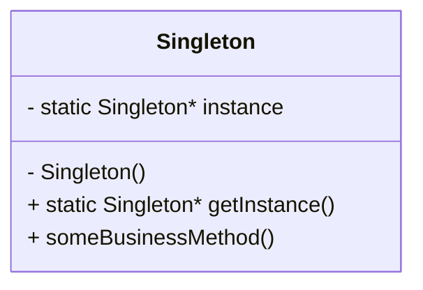
```mermaid
classDiagram
    class Singleton {
        - static Singleton* instance
        - Singleton()
        + static Singleton* getInstance()
        + someBusinessMethod()
    }
```

<div style="page-break-after: always;"></div>

### C++ Example
```cpp
#include <iostream>
#include <string>

class Logger {
private:
    static Logger* instance;
    // Private constructor prevents direct instantiation
    Logger() {}
public:
    static Logger* getInstance() {
        if (!instance) {
            instance = new Logger();
        }
        return instance;
    }

    void log(const std::string& message) {
        std::cout << "[LOG]: " << message << std::endl;
    }
};

// Initialize static member
Logger* Logger::instance = nullptr;

int main() {
    // Both pointers refer to the same Logger instance
    Logger* logger1 = Logger::getInstance();
    Logger* logger2 = Logger::getInstance();
    
    logger1->log("Singleton pattern in action!");
    logger2->log("Same logger instance is used here.");

    return 0;
}
```

<div style="page-break-after: always;"></div>

---

## Pattern C2: Factory Method

### Concept
Define an interface for creating an object, but let subclasses decide which class to instantiate. The **factory** method delegates object creation to subclasses.

### Real-World Analogy
- **Bakery**: You ask for “bread” (the abstract product). Depending on the bakery, you might get “white bread,” “whole wheat bread,” or “sourdough.” The “factory” (bakery) decides the exact type.

### Use Case
- GUI framework generating different button types (WindowsButton vs. MacButton).
- When a class cannot anticipate the exact type of objects it must create.

### C++ Concepts Demonstrated
- **Inheritance**: Concrete factory classes inherit from an abstract base factory.
- **Polymorphism**: The `createProduct()` or `createShape()` method is overridden to provide specific products.

### UML Diagram
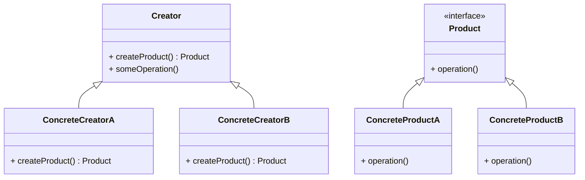
```mermaid
classDiagram
    class Creator {
        + createProduct() Product
        + someOperation()
    }
    class ConcreteCreatorA {
        + createProduct() Product
    }
    class ConcreteCreatorB {
        + createProduct() Product
    }
    class Product {
        <<interface>>
        + operation()
    }
    class ConcreteProductA {
        + operation()
    }
    class ConcreteProductB {
        + operation()
    }

    Creator <|-- ConcreteCreatorA
    Creator <|-- ConcreteCreatorB
    Product <|-- ConcreteProductA
    Product <|-- ConcreteProductB
```

<div style="page-break-after: always;"></div>

### C++ Example
```cpp
#include <iostream>
#include <memory>
#include <string>

// Product Interface
class Shape {
public:
    virtual ~Shape() {}
    virtual void draw() const = 0;
};

// Concrete Products
class Circle : public Shape {
public:
    void draw() const override {
        std::cout << "Drawing a Circle" << std::endl;
    }
};

class Rectangle : public Shape {
public:
    void draw() const override {
        std::cout << "Drawing a Rectangle" << std::endl;
    }
};

// Creator
class ShapeFactory {
public:
    virtual ~ShapeFactory() {}
    virtual std::unique_ptr<Shape> createShape() const = 0;
};

// Concrete Creators
class CircleFactory : public ShapeFactory {
public:
    std::unique_ptr<Shape> createShape() const override {
        return std::make_unique<Circle>();
    }
};

class RectangleFactory : public ShapeFactory {
public:
    std::unique_ptr<Shape> createShape() const override {
        return std::make_unique<Rectangle>();
    }
};

// Client
int main() {
    std::unique_ptr<ShapeFactory> factoryA = std::make_unique<CircleFactory>();
    auto shapeA = factoryA->createShape();
    shapeA->draw();

    std::unique_ptr<ShapeFactory> factoryB = std::make_unique<RectangleFactory>();
    auto shapeB = factoryB->createShape();
    shapeB->draw();

    return 0;
}
```

<div style="page-break-after: always;"></div>

---

## Pattern C3: Abstract Factory

### Concept
Provides an interface for creating **families** of related or dependent objects without specifying their concrete classes.

### Real-World Analogy
- **Furniture Shop**: An Art Deco furniture factory can create “Art Deco Chair” and “Art Deco Sofa,” while a Victorian factory can create “Victorian Chair” and “Victorian Sofa.” Each factory consistently creates a family of matching furniture items.

### Use Case
- Creating UI elements for multiple platforms (Windows, Mac, Linux) while keeping consistency.
- Whenever you need to ensure that products from the same family work well together.

### C++ Concepts Demonstrated
- **Polymorphism** & **Inheritance**: Abstract factory defines the interface; concrete factories implement it.
- **Encapsulation**: Hide object creation behind a factory interface.

### UML Diagram
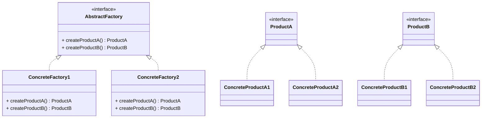
```mermaid
classDiagram
    class AbstractFactory {
        <<interface>>
        + createProductA() ProductA
        + createProductB() ProductB
    }
    class ConcreteFactory1 {
        + createProductA() ProductA
        + createProductB() ProductB
    }
    class ConcreteFactory2 {
        + createProductA() ProductA
        + createProductB() ProductB
    }
    class ProductA {
        <<interface>>
    }
    class ProductB {
        <<interface>>
    }
    class ConcreteProductA1
    class ConcreteProductA2
    class ConcreteProductB1
    class ConcreteProductB2

    AbstractFactory <|.. ConcreteFactory1
    AbstractFactory <|.. ConcreteFactory2
    ProductA <|.. ConcreteProductA1
    ProductA <|.. ConcreteProductA2
    ProductB <|.. ConcreteProductB1
    ProductB <|.. ConcreteProductB2
```

<div style="page-break-after: always;"></div>


```cpp
#include <iostream> #include <memory>
// Product A
class Button {
public:
    virtual ~Button() {}
    virtual void paint() = 0;
};

class WinButton : public Button {
public:
    void paint() override { std::cout << "Windows Button painted." << std::endl;}
};

class MacButton : public Button {
public:
    void paint() override {std::cout << "Mac Button painted." << std::endl;}
};

// Product B
class Checkbox {
public:
    virtual ~Checkbox() {}
    virtual void draw() = 0;
};

class WinCheckbox : public Checkbox {
public:
    void draw() override { std::cout << "Windows Checkbox drawn." << std::endl;}
};

class MacCheckbox : public Checkbox {
public:
    void draw() override { std::cout << "Mac Checkbox drawn." << std::endl;}
};

// Abstract Factory
class GUIFactory {
public:
    virtual ~GUIFactory() {}
    virtual std::unique_ptr<Button> createButton() = 0;
    virtual std::unique_ptr<Checkbox> createCheckbox() = 0;
};

// Concrete Factories
class WinFactory : public GUIFactory {
public:
    std::unique_ptr<Button> createButton() override { return std::make_unique<WinButton>();}
    std::unique_ptr<Checkbox> createCheckbox() override { return std::make_unique<WinCheckbox>(); }
};

class MacFactory : public GUIFactory {
public:
    std::unique_ptr<Button> createButton() override { return std::make_unique<MacButton>(); }
    std::unique_ptr<Checkbox> createCheckbox() override { return std::make_unique<MacCheckbox>(); }
};
// Client
int main() {
    // Create Windows GUI elements
    std::unique_ptr<GUIFactory> guiFactory = std::make_unique<WinFactory>();
    auto button = guiFactory->createButton();
    auto checkbox = guiFactory->createCheckbox();
    button->paint(); checkbox->draw();

    // Create Mac GUI elements
    guiFactory = std::make_unique<MacFactory>();
    auto macButton = guiFactory->createButton();
    auto macCheckbox = guiFactory->createCheckbox();
    macButton->paint(); macCheckbox->draw(); return 0;}
```

<div style="page-break-after: always;"></div>

---

## Pattern C4: Builder

### Concept
Separates the construction of a complex object from its representation so that the same construction process can create different representations.

### Real-World Analogy
- **Restaurant Meal**: A waiter (Director) takes the same steps to build a meal (starter, main, dessert), but the exact items can differ (vegetarian meal vs. non-vegetarian meal).

### Use Case
- Building complex objects (e.g., cars with different engines, wheels, and colors).
- Step-by-step object creation with multiple variations.

### C++ Concepts Demonstrated
- **Encapsulation** of construction steps in a Builder class.
- **Abstraction**: The Director is abstracted from the complex creation details.

### UML Diagram
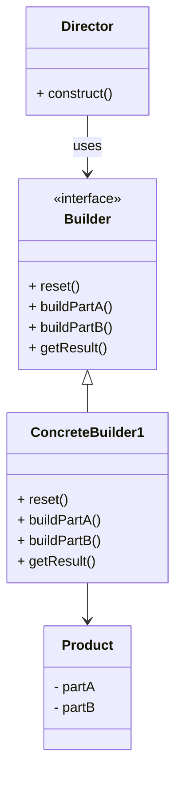
```mermaid
classDiagram
    class Director {
        + construct()
    }
    class Builder {
        <<interface>>
        + reset()
        + buildPartA()
        + buildPartB()
        + getResult()
    }
    class ConcreteBuilder1 {
        + reset()
        + buildPartA()
        + buildPartB()
        + getResult()
    }
    class Product{
        - partA
        - partB
    }

    Director --> Builder : uses
    Builder <|-- ConcreteBuilder1
    ConcreteBuilder1 --> Product
```

<div style="page-break-after: always;"></div>

### C++ Example
```cpp

// The Product
class Car {
public:
    std::string engine;
    std::string wheels;
    std::string color;
    void printDetails() {
        std::cout << "Car with " << engine << ", " << wheels
                  << " and painted " << color << "." << std::endl;
    }
};

// Builder Interface
class CarBuilder {
public:
    virtual ~CarBuilder() {}
    virtual void reset() = 0;
    virtual void setEngine(const std::string& type) = 0;
    virtual void setWheels(const std::string& type) = 0;
    virtual void setColor(const std::string& color) = 0;
    virtual Car getResult() = 0;
};

// Concrete Builder
class SportsCarBuilder : public CarBuilder {
private:
    Car car;
public:
    void reset() override {
        car = Car();
    }
    void setEngine(const std::string& type) override {
        car.engine = type;
    }
    void setWheels(const std::string& type) override {
        car.wheels = type;
    }
    void setColor(const std::string& color) override {
        car.color = color;
    }
    Car getResult() override {
        return car;
    }
};

// Director
class CarDirector {
public:
    Car constructSportsCar(CarBuilder& builder) {
        builder.reset();
        builder.setEngine("V8 Engine");
        builder.setWheels("Alloy Wheels");
        builder.setColor("Red");
        return builder.getResult();
    }
};

// Client
int main() {
    SportsCarBuilder builder;
    CarDirector director;
    Car mySportsCar = director.constructSportsCar(builder);
    mySportsCar.printDetails();  return 0; }
```

<div style="page-break-after: always;"></div>

---

## Pattern C5: Prototype

### Concept
Specify the kinds of objects to create using a **prototypical** instance, and create new objects by copying (cloning) this prototype.

### Real-World Analogy
- **Cookie Cutter**: You have a base cookie shape (the prototype). You then make many cookies by stamping out copies of that prototype shape.

### Use Case
- When object creation is expensive or complicated, but you can create copies or clones from an existing instance.
- Copying or duplicating game units with minor tweaks.

### C++ Concepts Demonstrated
- **Cloning** and **Copying** objects.
- **Encapsulation** of the clone logic in the prototype class.

### UML Diagram
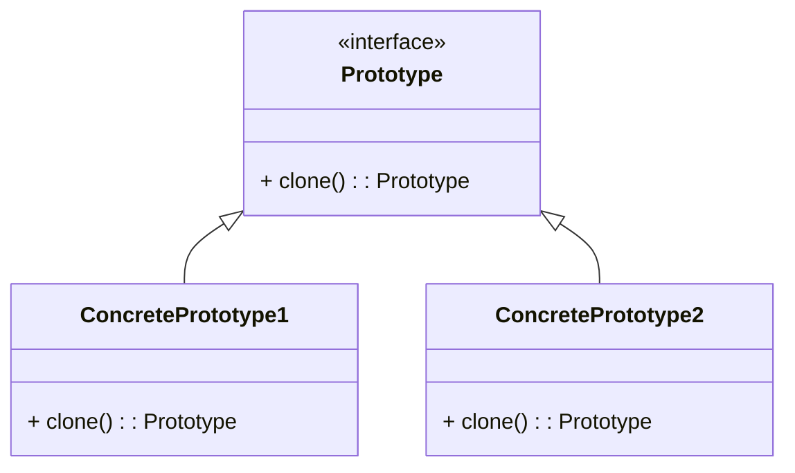
```mermaid
classDiagram
    class Prototype {
        <<interface>>
        + clone(): Prototype
    }
    class ConcretePrototype1 {
        + clone(): Prototype
    }
    class ConcretePrototype2 {
        + clone(): Prototype
    }

    Prototype <|-- ConcretePrototype1
    Prototype <|-- ConcretePrototype2
```

<div style="page-break-after: always;"></div>

### C++ Example
```cpp
#include <iostream>
#include <memory>
#include <string>

class Shape {
public:
    virtual ~Shape() {}
    virtual std::unique_ptr<Shape> clone() const = 0;
    virtual void draw() const = 0;
};

class Circle : public Shape {
private:
    float radius;
public:
    Circle(float r) : radius(r) {}
    std::unique_ptr<Shape> clone() const override {
        return std::make_unique<Circle>(*this); // invokes copy constructor
    }
    void draw() const override {
        std::cout << "Drawing Circle with radius " << radius << std::endl;
    }
};

int main() {
    std::unique_ptr<Shape> originalCircle = std::make_unique<Circle>(5.0f);
    originalCircle->draw();

    // Clone the original circle
    std::unique_ptr<Shape> clonedCircle = originalCircle->clone();
    clonedCircle->draw();

    return 0;
}
```

<div style="page-break-after: always;"></div>

---

# STRUCTURAL PATTERNS

Structural patterns show how to assemble objects and classes into larger structures while keeping them flexible and efficient.

## Pattern S1: Adapter

### Concept
Converts the interface of a class into another interface the client expects. The Adapter lets classes work together that otherwise couldn’t due to incompatible interfaces.

### Real-World Analogy
- **Power Plug Adapter**: In different countries, the shape of the plug is different. An adapter “converts” your plug to match the local socket interface.

### Use Case
- Integrating a legacy system with a new system when their interfaces differ.
- Reusing existing classes but making them comply with a new interface.

### C++ Concepts Demonstrated
- **Composition**: The Adapter contains an instance of the Adaptee class.
- **Encapsulation**: The Adapter hides the complex or incompatible interface.

### UML Diagram
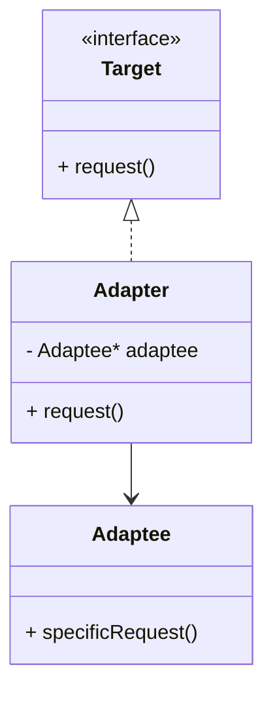
```mermaid
classDiagram
    class Target {
        <<interface>>
        + request()
    }
    class Adapter {
        - Adaptee* adaptee
        + request()
    }
    class Adaptee {
        + specificRequest()
    }

    Target <|.. Adapter
    Adapter --> Adaptee
```

<div style="page-break-after: always;"></div>

### C++ Example
```cpp
#include <iostream>

// Target interface
class MediaPlayer {
public:
    virtual void play() = 0;
    virtual ~MediaPlayer() {}
};

// Adaptee
class AdvancedMediaPlayer {
public:
    void playAdvancedFormat() {
        std::cout << "Playing advanced media format." << std::endl;
    }
};

// Adapter
class MediaAdapter : public MediaPlayer {
private:
    AdvancedMediaPlayer* advancedPlayer;
public:
    MediaAdapter(AdvancedMediaPlayer* p) : advancedPlayer(p) {}
    void play() override {
        // Translate the request to Adaptee's method
        advancedPlayer->playAdvancedFormat();
    }
};

int main() {
    AdvancedMediaPlayer advanced;
    MediaAdapter adapter(&advanced);
    adapter.play();  // Internally calls playAdvancedFormat()

    return 0;
}
```

<div style="page-break-after: always;"></div>

---

## Pattern S2: Bridge

### Concept
Decouples an abstraction from its implementation so that the two can vary independently.

### Real-World Analogy
- **Remote Control and Devices**: A remote (Abstraction) can control different devices (Implementations) such as TV or Radio. Changing the device doesn’t require changing the remote logic.

### Use Case
- Avoid permanent binding between an abstraction and its implementation.
- When both the abstraction and implementation should be extensible independently.

### C++ Concepts Demonstrated
- **Composition**: The abstraction class “has-a” implementation pointer.
- **Polymorphism**: The implementation is interchangeable at runtime.

### UML Diagram
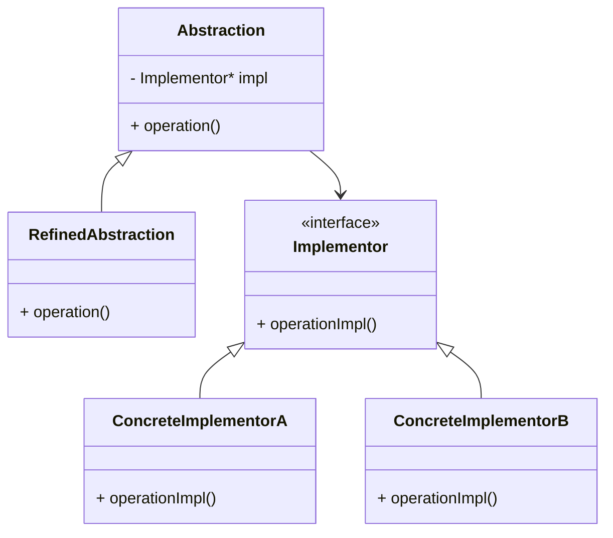
```mermaid
classDiagram
    class Abstraction {
        - Implementor* impl
        + operation()
    }
    class RefinedAbstraction {
        + operation()
    }
    class Implementor {
        <<interface>>
        + operationImpl()
    }
    class ConcreteImplementorA {
        + operationImpl()
    }
    class ConcreteImplementorB {
        + operationImpl()
    }

    Abstraction <|-- RefinedAbstraction
    Abstraction --> Implementor
    Implementor <|-- ConcreteImplementorA
    Implementor <|-- ConcreteImplementorB
```

<div style="page-break-after: always;"></div>

### C++ Example
```cpp
#include <iostream>  #include <memory>

// Implementor
class Device {
public:
    virtual ~Device() {}
    virtual void powerOn() = 0;
    virtual void powerOff() = 0;
};

// Concrete Implementors
class TV : public Device {
public:
    void powerOn() override { std::cout << "TV is now ON." << std::endl;}
    void powerOff() override { std::cout << "TV is now OFF." << std::endl;}
};

class Radio : public Device {
public:
    void powerOn() override { std::cout << "Radio is now ON." << std::endl; }
    void powerOff() override { std::cout << "Radio is now OFF." << std::endl; }
};

// Abstraction
class RemoteControl {
protected:
    std::shared_ptr<Device> device;
public:
    RemoteControl(std::shared_ptr<Device> dev) : device(dev) {}
    virtual void togglePower() = 0;
};

// Refined Abstraction
class BasicRemote : public RemoteControl {
private:
    bool powerState;
public:
    BasicRemote(std::shared_ptr<Device> dev) : RemoteControl(dev), powerState(false) {}

    void togglePower() override {
        if (!powerState) {
            device->powerOn();
            powerState = true;
        } else {
            device->powerOff();
            powerState = false;
        }
    }
};

int main() {
    // Bridge usage example
    std::shared_ptr<Device> tv = std::make_shared<TV>();
    std::unique_ptr<RemoteControl> remote = std::make_unique<BasicRemote>(tv);
    remote->togglePower();  remote->togglePower();

    std::shared_ptr<Device> radio = std::make_shared<Radio>();
    remote = std::make_unique<BasicRemote>(radio);
    remote->togglePower(); remote->togglePower();  return 0; }
```

<div style="page-break-after: always;"></div>

---

## Pattern S3: Composite

### Concept
Composes objects into **tree** structures to represent part-whole hierarchies. The Composite lets clients treat individual objects and compositions uniformly.

### Real-World Analogy
- **File System**: Directories contain files or other directories. Both can be treated as “nodes,” supporting operations like `size`, `rename`, or `move`.

### Use Case
- GUI components that have containers, which themselves can contain child components.
- Hierarchical structures where leaf and container objects need uniform treatment.

### C++ Concepts Demonstrated
- **Recursion**: Directories holding directories.
- **Polymorphism**: Common interface for both leaf (File) and composite (Directory).

### UML Diagram
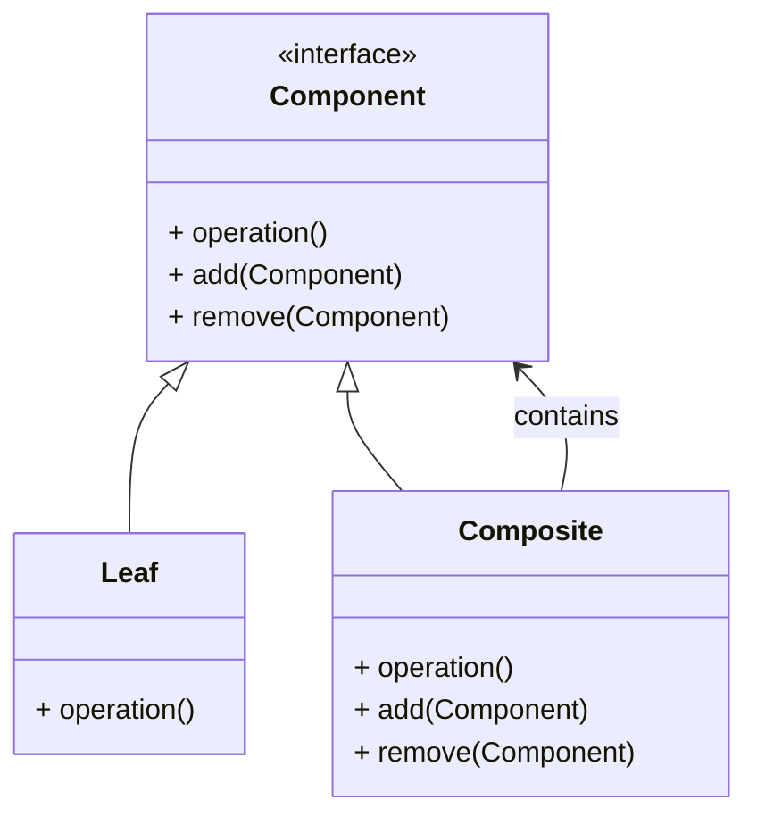
```mermaid
classDiagram
    class Component {
        <<interface>>
        + operation()
        + add(Component)
        + remove(Component)
    }
    class Leaf {
        + operation()
    }
    class Composite {
        + operation()
        + add(Component)
        + remove(Component)
    }
    Component <|-- Leaf
    Component <|-- Composite
    Composite --> Component : contains
```

<div style="page-break-after: always;"></div>

### C++ Example
```cpp
#include <iostream>
#include <vector>
#include <memory>

// Component
class FileSystemNode {
public:
    virtual ~FileSystemNode() {}
    virtual void displayInfo(int indent = 0) const = 0;
    virtual void add(std::shared_ptr<FileSystemNode> node) {}
    virtual void remove(std::shared_ptr<FileSystemNode> node) {}
};

// Leaf
class File : public FileSystemNode {
private:
    std::string name;
public:
    File(const std::string& n) : name(n) {}
    void displayInfo(int indent = 0) const override {
        std::cout << std::string(indent, ' ') << "File: " << name << std::endl;
    }
};

// Composite
class Directory : public FileSystemNode {
private:
    std::string name;
    std::vector<std::shared_ptr<FileSystemNode>> children;
public:
    Directory(const std::string& n) : name(n) {}
    
    void displayInfo(int indent = 0) const override {
        std::cout << std::string(indent, ' ') << "Directory: " << name << std::endl;
        for (const auto& child : children) {
            child->displayInfo(indent + 2);
        }
    }
    
    void add(std::shared_ptr<FileSystemNode> node) override {
        children.push_back(node);
    }
    
    void remove(std::shared_ptr<FileSystemNode> node) override {
        // Omitted for brevity
    }
};

// Client
int main() {
    auto root = std::make_shared<Directory>("root");
    auto home = std::make_shared<Directory>("home");
    auto userFile = std::make_shared<File>("user.txt");
    auto configFile = std::make_shared<File>("config.ini");
    
    root->add(home);
    home->add(userFile);
    root->add(configFile);

    root->displayInfo();

    return 0;
}
```

<div style="page-break-after: always;"></div>

---

## Pattern S4: Decorator

### Concept
Attaches additional responsibilities to an object dynamically. Decorators provide a flexible alternative to subclassing for extending functionality.

### Real-World Analogy
- **Adding toppings to an ice cream**: You can wrap the base ice cream with “chocolate sauce,” then wrap that in “sprinkles,” etc. Each “wrapper” adds extra features (flavors/cost).

### Use Case
- Dynamically adding behavior at runtime (e.g., “scroll bar” to a “Window”).
- Wrapping existing objects to modify or extend their functionality (I/O streams with buffering or encryption).

### C++ Concepts Demonstrated
- **Composition**: Decorator wraps a component object.
- **Polymorphism**: Decorator implements the same interface as the component.

### UML Diagram
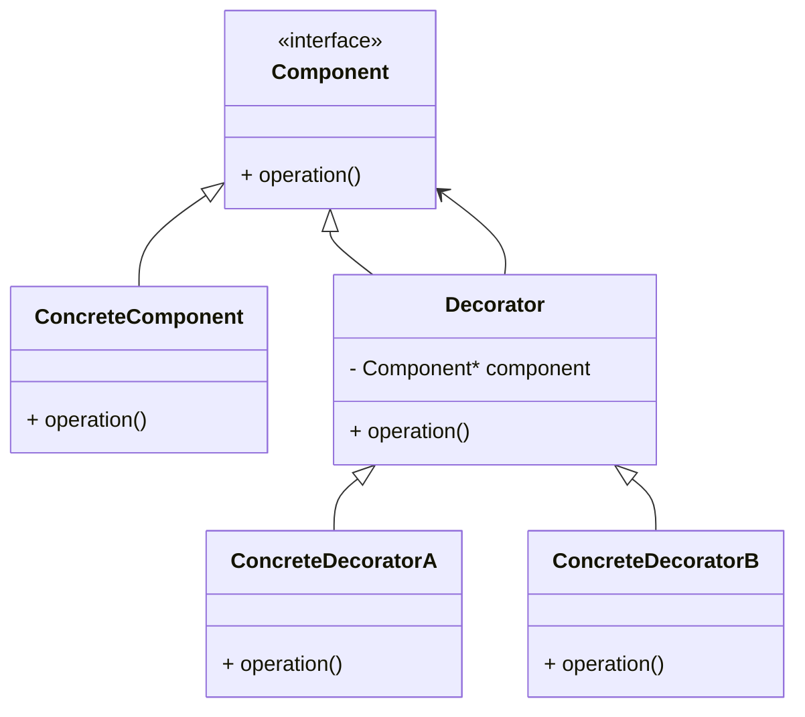
```mermaid
classDiagram
    class Component {
        <<interface>>
        + operation()
    }
    class ConcreteComponent {
        + operation()
    }
    class Decorator {
        - Component* component
        + operation()
    }
    class ConcreteDecoratorA {
        + operation()
    }
    class ConcreteDecoratorB {
        + operation()
    }
    Component <|-- ConcreteComponent
    Component <|-- Decorator
    Decorator <|-- ConcreteDecoratorA
    Decorator <|-- ConcreteDecoratorB
    Decorator --> Component
```

<div style="page-break-after: always;"></div>

### C++ Example
```cpp
#include <iostream> #include <memory>

// Component Interface
class Beverage {
public:
    virtual ~Beverage() {}
    virtual std::string getDescription() const = 0;
    virtual double cost() const = 0;
};

// Concrete Component
class Coffee : public Beverage {
public:
    std::string getDescription() const override { return "Coffee"; }
    double cost() const override { return 2.0; }
};

// Decorator
class BeverageDecorator : public Beverage {
protected:
    std::shared_ptr<Beverage> wrappedBeverage;
public:
    BeverageDecorator(std::shared_ptr<Beverage> beverage)
        : wrappedBeverage(beverage) {}
};

// Concrete Decorators
class MilkDecorator : public BeverageDecorator {
public:
    MilkDecorator(std::shared_ptr<Beverage> beverage)
        : BeverageDecorator(beverage) {}
    std::string getDescription() const override {
        return wrappedBeverage->getDescription() + ", Milk";
    }
    double cost() const override {
        return wrappedBeverage->cost() + 0.5;
    }
};

class SugarDecorator : public BeverageDecorator {
public:
    SugarDecorator(std::shared_ptr<Beverage> beverage)
        : BeverageDecorator(beverage) {}
    std::string getDescription() const override {
        return wrappedBeverage->getDescription() + ", Sugar";
    }
    double cost() const override {
        return wrappedBeverage->cost() + 0.2;
    }
};
// Client
int main() {
    std::shared_ptr<Beverage> coffee = std::make_shared<Coffee>();
    coffee = std::make_shared<MilkDecorator>(coffee);
    coffee = std::make_shared<SugarDecorator>(coffee);

    std::cout << "Order: " << coffee->getDescription() << " | Cost: $" << coffee->cost() << std::endl;
    return 0; }
```

<div style="page-break-after: always;"></div>

---

## Pattern S5: Facade

### Concept
Provides a unified interface to a set of interfaces in a subsystem, making the subsystem easier to use.

### Real-World Analogy
- **Car Dashboard**: You have a single dashboard to start the engine, control AC, etc. Under the hood, many subsystems (ignition, fuel pump, electronics) are working, but you only see the “facade” (the dashboard controls).

### Use Case
- Simplify a complex library or framework by providing a single entry point.
- Providing a single interface to multiple complex subsystems.

### C++ Concepts Demonstrated
- **Encapsulation**: The Facade hides subsystem complexity.
- **Abstraction**: The client interacts with high-level methods.

### UML Diagram
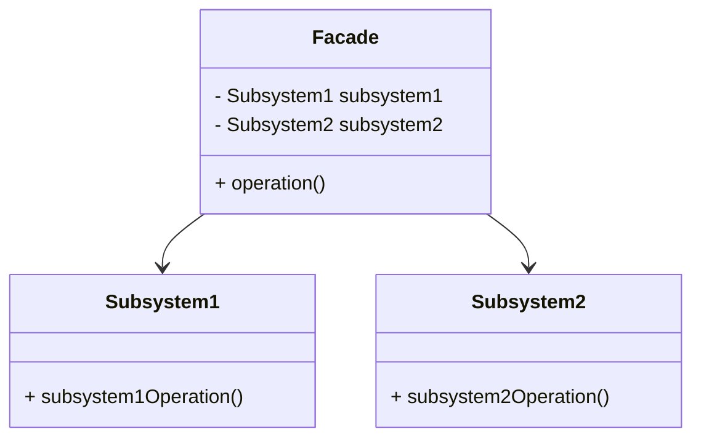
```mermaid
classDiagram
    class Facade {
        - Subsystem1 subsystem1
        - Subsystem2 subsystem2
        + operation()
    }
    class Subsystem1 {
        + subsystem1Operation()
    }
    class Subsystem2 {
        + subsystem2Operation()
    }

    Facade --> Subsystem1
    Facade --> Subsystem2
```
<div style="page-break-after: always;"></div>

### C++ Example
```cpp
#include <iostream>

class AudioSystem {
public:
    void setupAudio() {
        std::cout << "Audio system setup." << std::endl;
    }
};

class VideoSystem {
public:
    void setupVideo() {
        std::cout << "Video system setup." << std::endl;
    }
};

// Facade
class MediaFacade {
private:
    AudioSystem audio;
    VideoSystem video;
public:
    void startMovie() {
        audio.setupAudio();
        video.setupVideo();
        std::cout << "Movie started!" << std::endl;
    }
};

// Client
int main() {
    MediaFacade media;
    media.startMovie();
    return 0;
}
```

<div style="page-break-after: always;"></div>

---

## Pattern S6: Flyweight

### Concept
Uses **sharing** to support a large number of fine-grained objects efficiently. A flyweight is a shared object that can be used in multiple contexts simultaneously.

### Real-World Analogy
- **Characters in a Text Editor**: Instead of storing separate glyph objects for every character typed, you store a shared “A” object and keep an external reference to its position/style.

### Use Case
- Large number of identical or similar objects (e.g., game tiles, text glyphs).
- Minimizing memory usage by sharing intrinsic data.

### C++ Concepts Demonstrated
- **Object Pooling**: Store and reuse flyweights.
- **Encapsulation** of intrinsic vs. extrinsic state.

### UML Diagram
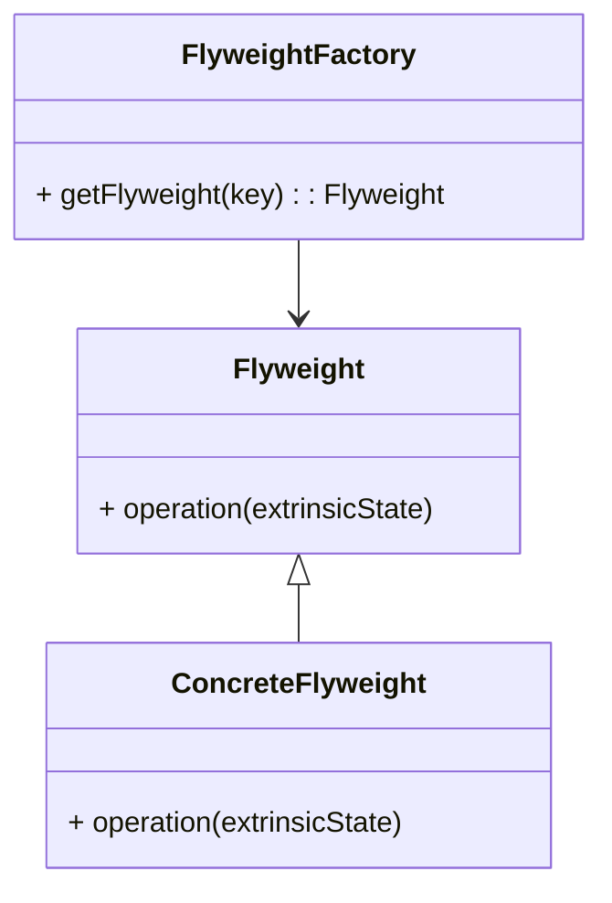
```mermaid
classDiagram
    class Flyweight {
        + operation(extrinsicState)
    }
    class ConcreteFlyweight {
        + operation(extrinsicState)
    }
    class FlyweightFactory {
        + getFlyweight(key): Flyweight
    }

    Flyweight <|-- ConcreteFlyweight
    FlyweightFactory --> Flyweight
```
<div style="page-break-after: always;"></div>

### C++ Example
```cpp
#include <iostream>
#include <string>
#include <map>
#include <memory>

// Flyweight Interface
class Character {
public:
    virtual ~Character() {}
    virtual void display(int fontSize) = 0; // extrinsic state
};

// Concrete Flyweight
class ConcreteCharacter : public Character {
private:
    char intrinsicChar; // Intrinsic state
public:
    ConcreteCharacter(char c) : intrinsicChar(c) {}
    void display(int fontSize) override {
        std::cout << "Character: " << intrinsicChar 
                  << " with font size " << fontSize << std::endl;
    }
};

// Flyweight Factory
class CharacterFactory {
private:
    std::map<char, std::shared_ptr<Character>> charMap;
public:
    std::shared_ptr<Character> getCharacter(char c) {
        if (charMap.find(c) == charMap.end()) {
            charMap[c] = std::make_shared<ConcreteCharacter>(c);
        }
        return charMap[c];
    }
};

int main() {
    CharacterFactory factory;
    std::shared_ptr<Character> c1 = factory.getCharacter('A');
    std::shared_ptr<Character> c2 = factory.getCharacter('B');
    std::shared_ptr<Character> c3 = factory.getCharacter('A'); // reuse 'A'

    c1->display(12);
    c2->display(14);
    c3->display(16);

    return 0;
}
```

<div style="page-break-after: always;"></div>

---

## Pattern S7: Proxy

### Concept
Provides a surrogate or placeholder for another object to control access to it.

### Real-World Analogy
- **Credit Card**: A proxy to your bank account; you don’t carry around your entire bank, but you use a card that represents and mediates access to the real funds.
- **Check or Bank Draft** is also a proxy for money.

### Use Case
- Lazy loading (virtual proxy).
- Access control (protection proxy).
- Logging or caching requests (caching proxy).

### C++ Concepts Demonstrated
- **Encapsulation**: The proxy class encapsulates real object creation.
- **Composition**: The proxy holds a reference to the real subject.

### UML Diagram
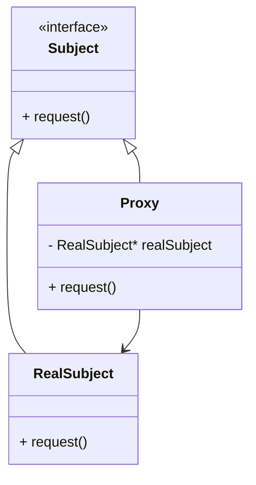
```mermaid
classDiagram
    class Subject {
        <<interface>>
        + request()
    }
    class RealSubject {
        + request()
    }
    class Proxy {
        - RealSubject* realSubject
        + request()
    }

    Subject <|-- RealSubject
    Subject <|-- Proxy
    Proxy --> RealSubject
```

<div style="page-break-after: always;"></div>

### C++ Example
```cpp
#include <iostream>
#include <memory>

// Subject interface
class Image {
public:
    virtual ~Image() {}
    virtual void display() = 0;
};

// RealSubject
class HighResolutionImage : public Image {
private:
    std::string fileName;
public:
    HighResolutionImage(const std::string& file) : fileName(file) {
        // Expensive operation (loading a big image)
        std::cout << "Loading high-resolution image from " << file << std::endl;
    }
    void display() override {
        std::cout << "Displaying high-resolution image: " << fileName << std::endl;
    }
};

// Proxy
class ImageProxy : public Image {
private:
    std::string fileName;
    std::unique_ptr<HighResolutionImage> realImage;
public:
    ImageProxy(const std::string& file) : fileName(file) {}
    void display() override {
        if (!realImage) {
            realImage = std::make_unique<HighResolutionImage>(fileName);
        }
        realImage->display();
    }
};

// Client
int main() {
    ImageProxy proxy("big_photo.png");
    std::cout << "No actual image loaded yet.\n";

    // Load on demand
    proxy.display();

    return 0;
}
```

<div style="page-break-after: always;"></div>

---

# BEHAVIORAL PATTERNS

Behavioral patterns focus on communication between objects, describing how they interact and distribute responsibility.

## Pattern B1: Chain of Responsibility

### Concept
Gives more than one object a chance to handle a request by passing it along a chain of handlers until one handles it.

### Real-World Analogy
- **Technical Support Levels**: Customer calls a help desk. If Level 1 can’t handle, it escalates to Level 2, then Level 3, etc., until someone can solve the problem.

### Use Case
- Logging frameworks with different levels (DEBUG, INFO, ERROR).
- Event handling in GUI frameworks.

### C++ Concepts Demonstrated
- **Linked structure** of handlers.
- **Encapsulation**: Each handler deals with the request or forwards it.

### UML Diagram
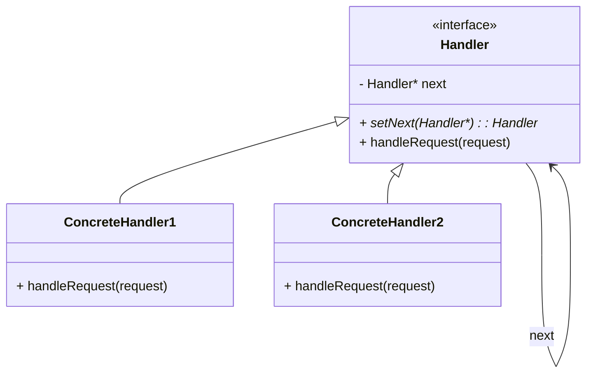
```mermaid
classDiagram
    class Handler {
        <<interface>>
        - Handler* next
        + setNext(Handler*): Handler*
        + handleRequest(request)
    }
    class ConcreteHandler1 {
        + handleRequest(request)
    }
    class ConcreteHandler2 {
        + handleRequest(request)
    }

    Handler <|-- ConcreteHandler1
    Handler <|-- ConcreteHandler2
    Handler --> Handler : next
```

<div style="page-break-after: always;"></div>

### C++ Example
```cpp
#include <iostream>  #include <memory>

class Handler {
protected:
    std::shared_ptr<Handler> nextHandler;
public:
    virtual ~Handler() {}
    void setNext(std::shared_ptr<Handler> handler) {
        nextHandler = handler;
    }
    virtual void handleRequest(int level) {
        if (nextHandler) {
            nextHandler->handleRequest(level);
        }
    }
};

class DebugHandler : public Handler {
public:
    void handleRequest(int level) override {
        if (level <= 1) {
            std::cout << "DebugHandler handled request (level " << level << ")." << std::endl;
        } else { Handler::handleRequest(level);}
    }
};

class InfoHandler : public Handler {
public:
    void handleRequest(int level) override {
        if (level == 2) {
            std::cout << "InfoHandler handled request (level " << level << ")." << std::endl;
        } else { Handler::handleRequest(level);}
    }
};

class ErrorHandler : public Handler {
public:
    void handleRequest(int level) override {
        if (level >= 3) {
            std::cout << "ErrorHandler handled request (level " << level << ")." << std::endl;
        } else {
            Handler::handleRequest(level);
        }
    }
};
int main() {
    // Build the chain
    auto debugHandler = std::make_shared<DebugHandler>();
    auto infoHandler = std::make_shared<InfoHandler>();
    auto errorHandler = std::make_shared<ErrorHandler>();

    debugHandler->setNext(infoHandler);
    infoHandler->setNext(errorHandler);

    // Test different levels
    debugHandler->handleRequest(1); // DebugHandler
    debugHandler->handleRequest(2); // InfoHandler
    debugHandler->handleRequest(3); // ErrorHandler

    return 0;}
```

<div style="page-break-after: always;"></div>

---

## Pattern B2: Command

### Concept
Encapsulates a request as an object, allowing you to parameterize clients with different requests, queue or log requests, and support undo/redo.

### Real-World Analogy
- **Restaurant Order (Command)**: A waiter takes an “order” object (the command) to the chef (the receiver). The kitchen (receiver) executes the order.

### Use Case
- GUI buttons, menu items (each triggers a command).
- Task scheduling, macros, undo/redo systems.

### C++ Concepts Demonstrated
- **Encapsulation** of an action in an object.
- **Loose coupling** between Invoker (button) and Receiver (the actual operation).

### UML Diagram
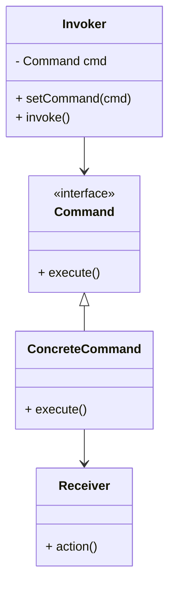
```mermaid
classDiagram
    class Command {
        <<interface>>
        + execute()
    }
    class ConcreteCommand {
        + execute()
    }
    class Invoker {
        - Command cmd
        + setCommand(cmd)
        + invoke()
    }
    class Receiver {
        + action()
    }

    Command <|-- ConcreteCommand
    ConcreteCommand --> Receiver
    Invoker --> Command
```

<div style="page-break-after: always;"></div>

### C++ Example
```cpp
#include <iostream> #include <memory>

// Receiver
class Light {
public:
    void turnOn() { std::cout << "Light turned on." << std::endl; }
    void turnOff() { std::cout << "Light turned off." << std::endl;}
};

// Command Interface
class Command {
public:
    virtual ~Command() {}
    virtual void execute() = 0;
};

// Concrete Commands
class TurnOnCommand : public Command {
private:
    Light& light;
public:
    TurnOnCommand(Light& l) : light(l) {}
    void execute() override {
        light.turnOn();
    }
};

class TurnOffCommand : public Command {
private:
    Light& light;
public:
    TurnOffCommand(Light& l) : light(l) {}
    void execute() override {
        light.turnOff();
    }
};

// Invoker
class RemoteControl {
private:
    std::shared_ptr<Command> command;
public:
    void setCommand(std::shared_ptr<Command> cmd) { command = cmd; }
    void pressButton() {
        if (command) { command->execute(); }
    }
};
// Client
int main() {
    Light lamp;
    auto onCommand = std::make_shared<TurnOnCommand>(lamp);
    auto offCommand = std::make_shared<TurnOffCommand>(lamp);

    RemoteControl remote;
    remote.setCommand(onCommand);
    remote.pressButton(); // Light turned on.

    remote.setCommand(offCommand);
    remote.pressButton(); // Light turned off.
    return 0;}
```

<div style="page-break-after: always;"></div>

---

## Pattern B3: Interpreter

### Concept
Given a language, define a representation for its grammar along with an interpreter that uses the representation to interpret sentences in the language.

### Real-World Analogy
- **Rule-based systems**: For example, a small grammar or rule set for validating user inputs.

### Use Case
- Simple scripting or expression evaluation (e.g., math expressions).
- Domain-specific languages where you define rules/grammar.

### C++ Concepts Demonstrated
- **Recursive structure**: Abstract syntax tree (AST).
- **Encapsulation**: Each node (expression) knows how to interpret itself.

### UML Diagram
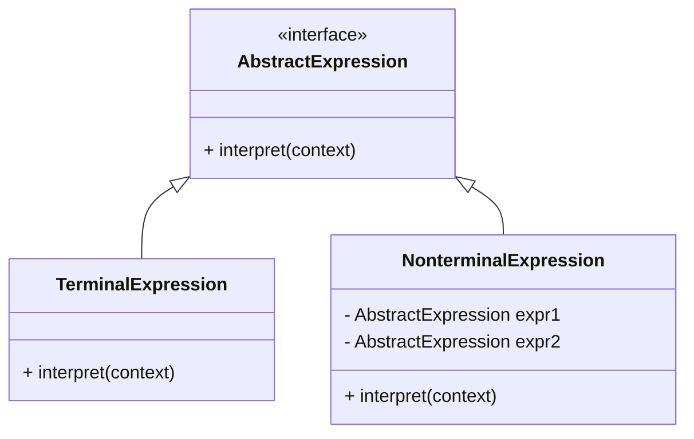
```mermaid
classDiagram
    class AbstractExpression {
        <<interface>>
        + interpret(context)
    }
    class TerminalExpression {
        + interpret(context)
    }
    class NonterminalExpression {
        - AbstractExpression expr1
        - AbstractExpression expr2
        + interpret(context)
    }

    AbstractExpression <|-- TerminalExpression
    AbstractExpression <|-- NonterminalExpression
```

<div style="page-break-after: always;"></div>

### C++ Example
```cpp
#include <iostream>
#include <string>
#include <sstream>
#include <vector>
#include <memory>

// Expression interface
class Expression {
public:
    virtual ~Expression() {}
    virtual int interpret() const = 0;
};

// Terminal Expression (number)
class NumberExpression : public Expression {
private:
    int number;
public:
    NumberExpression(int value) : number(value) {}
    int interpret() const override {
        return number;
    }
};

// Nonterminal Expression (addition)
class AddExpression : public Expression {
private:
    std::unique_ptr<Expression> left;
    std::unique_ptr<Expression> right;
public:
    AddExpression(std::unique_ptr<Expression> l, std::unique_ptr<Expression> r)
        : left(std::move(l)), right(std::move(r)) {}
    int interpret() const override {
        return left->interpret() + right->interpret();
    }
};

// Simple parser for "number + number"
std::unique_ptr<Expression> parse(const std::string& input) {
    std::istringstream ss(input);
    int a, b;
    char plus;
    ss >> a >> plus >> b; // e.g., "3 + 5"
    return std::make_unique<AddExpression>(
        std::make_unique<NumberExpression>(a),
        std::make_unique<NumberExpression>(b)
    );
}

int main() {
    std::string expression = "3 + 5";
    auto expr = parse(expression);
    std::cout << expression << " = " << expr->interpret() << std::endl; // 8
    return 0;
}
```

<div style="page-break-after: always;"></div>

---

## Pattern B4: Iterator

### Concept
Provides a way to access the elements of an aggregate object sequentially without exposing its underlying representation.

### Real-World Analogy
- **TV Channel Remote**: You “iterate” channels by pressing next/previous. You don’t need to know how the TV internally stores channel data.

### Use Case
- Uniform traversal over different data structures (e.g., arrays, lists, trees).
- Hiding the complexity of the underlying container from the client.

### C++ Concepts Demonstrated
- **Abstraction** of the iteration logic.
- **Encapsulation**: The container’s internal representation remains hidden.

### UML Diagram
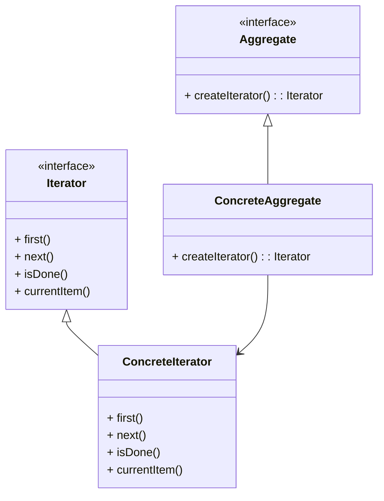
```mermaid
classDiagram
    class Aggregate {
        <<interface>>
        + createIterator(): Iterator
    }
    class ConcreteAggregate {
        + createIterator(): Iterator
    }
    class Iterator {
        <<interface>>
        + first()
        + next()
        + isDone()
        + currentItem()
    }
    class ConcreteIterator {
        + first()
        + next()
        + isDone()
        + currentItem()
    }

    Aggregate <|-- ConcreteAggregate
    Iterator <|-- ConcreteIterator
    ConcreteAggregate --> ConcreteIterator
```

<div style="page-break-after: always;"></div>

### C++ Example
```cpp
#include <iostream>
#include <vector>
#include <memory>

template <typename T>
class Iterator {
public:
    virtual ~Iterator() {}
    virtual void first() = 0;
    virtual void next() = 0;
    virtual bool isDone() const = 0;
    virtual T currentItem() const = 0;
};

template <typename T>
class ContainerIterator : public Iterator<T> {
private:
    std::vector<T> &collection;
    size_t index;
public:
    ContainerIterator(std::vector<T>& vec) : collection(vec), index(0) {}
    
    void first() override {
        index = 0;
    }
    void next() override {
        if (index < collection.size()) {
            index++;
        }
    }
    bool isDone() const override {
        return index >= collection.size();
    }
    T currentItem() const override {
        if (!isDone()) {
            return collection[index];
        }
        throw std::out_of_range("Iterator out of range.");
    }
};

int main() {
    std::vector<int> numbers = {1, 2, 3, 4, 5};
    ContainerIterator<int> it(numbers);

    for (it.first(); !it.isDone(); it.next()) {
        std::cout << it.currentItem() << " ";
    }
    std::cout << std::endl;
    return 0;
}
```

<div style="page-break-after: always;"></div>

---

## Pattern B5: Mediator

### Concept
Defines an object that encapsulates how a set of objects interact. The Mediator promotes loose coupling by preventing objects from referring to each other explicitly.

### Real-World Analogy
- **Air Traffic Control**: Pilots (Colleagues) communicate through the control tower (Mediator), rather than directly with each other.

### Use Case
- Chat rooms where multiple users (Colleagues) communicate via a single ChatRoom (Mediator).
- GUI forms with multiple fields that need to coordinate changes.

### C++ Concepts Demonstrated
- **Loose Coupling**: Colleagues communicate only through the Mediator.
- **Encapsulation** of the complex interaction logic in the Mediator.

### UML Diagram
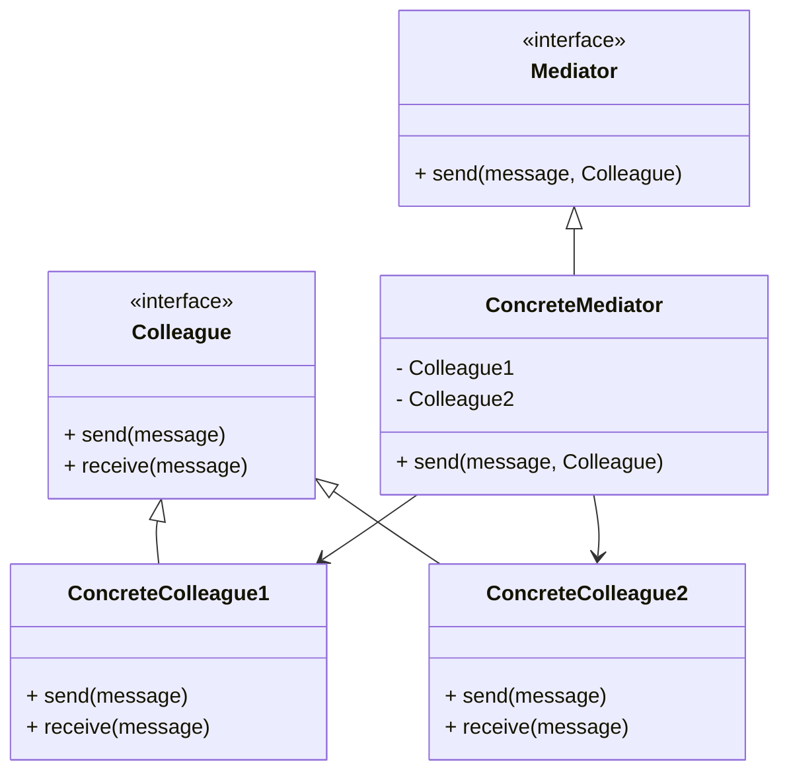
```mermaid
classDiagram
    class Mediator {
        <<interface>>
        + send(message, Colleague)
    }
    class ConcreteMediator {
        + send(message, Colleague)
        - Colleague1
        - Colleague2
    }
    class Colleague {
        <<interface>>
        + send(message)
        + receive(message)
    }
    class ConcreteColleague1 {
        + send(message)
        + receive(message)
    }
    class ConcreteColleague2 {
        + send(message)
        + receive(message)
    }

    Mediator <|-- ConcreteMediator
    Colleague <|-- ConcreteColleague1
    Colleague <|-- ConcreteColleague2
    ConcreteMediator --> ConcreteColleague1
    ConcreteMediator --> ConcreteColleague2
```

<div style="page-break-after: always;"></div>

### C++ Example
```cpp
#include <iostream> #include <string> #include <memory> #include <vector>
class Colleague;

// Mediator Interface
class ChatMediator {
public:
    virtual ~ChatMediator() {}
    virtual void sendMessage(const std::string& message, Colleague* sender) = 0;
    virtual void addColleague(Colleague* colleague) = 0;
};

// Colleague Interface
class Colleague {
protected:
    ChatMediator* mediator;
public:
    Colleague(ChatMediator* m) : mediator(m) {}
    virtual void send(const std::string& message) = 0;
    virtual void receive(const std::string& message) = 0;
};

// Concrete Mediator
class ConcreteChatMediator : public ChatMediator {
private:
    std::vector<Colleague*> colleagues;
public:
    void sendMessage(const std::string& message, Colleague* sender) override {
        for (auto colleague : colleagues) {
            if (colleague != sender) { colleague->receive(message); }
        }
    }
    void addColleague(Colleague* colleague) override {
        colleagues.push_back(colleague);
    }
};

// Concrete Colleagues
class User : public Colleague {
private:
    std::string name;
public:
    User(const std::string& n, ChatMediator* m) : Colleague(m), name(n) {}
    void send(const std::string& message) override {
        std::cout << name << " sends: " << message << std::endl;
        mediator->sendMessage(message, this);
    }
    void receive(const std::string& message) override {
        std::cout << name << " receives: " << message << std::endl;
    }
};
int main() {
    ConcreteChatMediator chatMediator;
    
    User user1("Alice", &chatMediator);
    User user2("Bob", &chatMediator);
    User user3("Charlie", &chatMediator);

    chatMediator.addColleague(&user1);
    chatMediator.addColleague(&user2);
    chatMediator.addColleague(&user3);

    user1.send("Hello, everyone!");
    user2.send("Hey Alice, how are you?");
    user3.send("Hello Bob and Alice!");     return 0;}
```

<div style="page-break-after: always;"></div>

---

## Pattern B6: Memento

### Concept
Without violating encapsulation, capture and externalize an object's internal state so that it can be restored to this state later.

### Real-World Analogy
- **Save Game**: You save the current game state and can later load it to resume exactly where you left off.

### Use Case
- Implementing undo/redo functionality in an editor.
- Saving game states or application states.

### C++ Concepts Demonstrated
- **Encapsulation**: The Originator’s internal state is kept private, but the Memento stores it securely.
- **Time-travel** in state management (undo/redo).

### UML Diagram
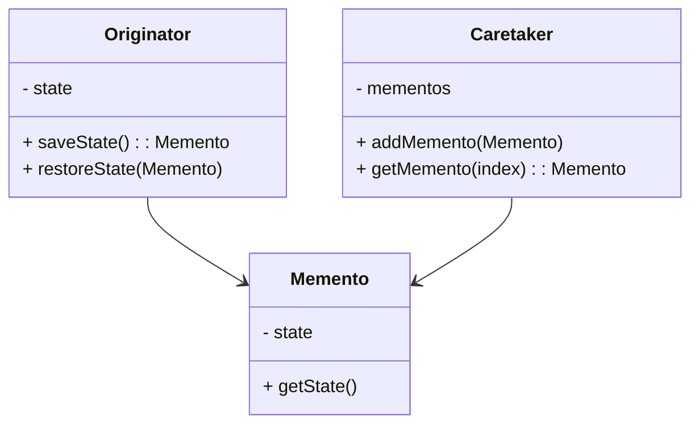
```mermaid
classDiagram
    class Originator {
        - state
        + saveState(): Memento
        + restoreState(Memento)
    }
    class Memento {
        - state
        + getState()
    }
    class Caretaker {
        - mementos
        + addMemento(Memento)
        + getMemento(index): Memento
    }

    Originator --> Memento
    Caretaker --> Memento
```

<div style="page-break-after: always;"></div>

### C++ Example
```cpp
#include <iostream> #include <string> #include <vector>

// Memento
class Memento {
private:
    std::string state;
public:
    Memento(const std::string& s) : state(s) {}
    std::string getState() const { return state;}
};

// Originator
class TextEditor {
private:
    std::string content;
public:
    void setText(const std::string& newText) { content = newText;}
    std::string getText() const { return content; }
    Memento saveState() const {
        return Memento(content);
    }
    void restoreState(const Memento& memento) {
        content = memento.getState();
    }
};

// Caretaker
class EditorHistory {
private:
    std::vector<Memento> history;
public:
    void push(const Memento& m) {
        history.push_back(m);
    }
    Memento pop() {
        if (!history.empty()) {
            Memento m = history.back();
            history.pop_back();
            return m;
        }
        return Memento("");
    }
};

int main() {
    TextEditor editor;
    EditorHistory history;

    editor.setText("Version 1");
    history.push(editor.saveState());

    editor.setText("Version 2");
    history.push(editor.saveState());

    editor.setText("Version 3");
    std::cout << "Current content: " << editor.getText() << std::endl;

    // Undo to Version 2
    editor.restoreState(history.pop());
    std::cout << "After undo: " << editor.getText() << std::endl;

    // Undo to Version 1
    editor.restoreState(history.pop());
    std::cout << "After second undo: " << editor.getText() << std::endl;
    return 0;}
```

<div style="page-break-after: always;"></div>

---

## Pattern B7: Observer

### Concept
Defines a **one-to-many** dependency between objects so that when one object (the Subject) changes state, all its dependents (Observers) are notified and updated automatically.

### Real-World Analogy
- **News Subscription**: When a newspaper (subject) has new content, all subscribers (observers) automatically receive the update.

### Use Case
- Event-based systems, publish-subscribe, or whenever multiple objects need to be informed of changes.
- GUI elements (Model-View-Controller).

### C++ Concepts Demonstrated
- **Loose Coupling**: Observers only know about the subject’s interface.
- **Encapsulation** of the subject’s internal state, but it notifies changes to observers.

### UML Diagram
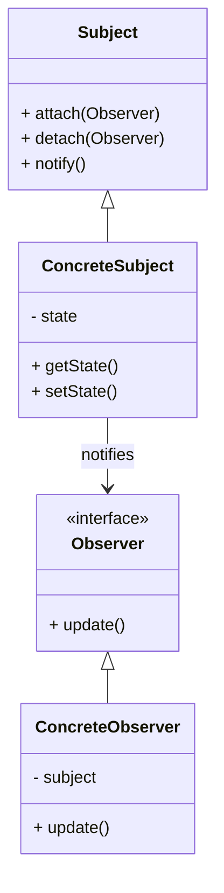
```mermaid
classDiagram
    class Subject {
        + attach(Observer)
        + detach(Observer)
        + notify()
    }
    class ConcreteSubject {
        - state
        + getState()
        + setState()
    }
    class Observer {
        <<interface>>
        + update()
    }
    class ConcreteObserver {
        - subject
        + update()
    }

    Subject <|-- ConcreteSubject
    Observer <|-- ConcreteObserver
    ConcreteSubject --> Observer : notifies
```

<div style="page-break-after: always;"></div>

### C++ Example
```cpp
#include <iostream>
#include <vector>
#include <memory>

// Observer Interface
class Observer {
public:
    virtual ~Observer() {}
    virtual void update(int newState) = 0;
};

// Subject
class Subject {
private:
    int state;
    std::vector<Observer*> observers;
public:
    void attach(Observer* obs) {
        observers.push_back(obs);
    }
    void detach(Observer* obs) {
        // remove from vector if needed
    }
    void setState(int newState) {
        state = newState;
        notify();
    }
    int getState() const {
        return state;
    }
    void notify() {
        for (auto obs : observers) {
            obs->update(state);
        }
    }
};

// Concrete Observer
class ConcreteObserver : public Observer {
private:
    std::string name;
    Subject& subject;
public:
    ConcreteObserver(const std::string& n, Subject& s) : name(n), subject(s) {}
    void update(int newState) override {
        std::cout << "Observer " << name << " got new state: " << newState << std::endl;
    }
};

// Client
int main() {
    Subject subject;
    ConcreteObserver obs1("Observer1", subject);
    ConcreteObserver obs2("Observer2", subject);

    subject.attach(&obs1);
    subject.attach(&obs2);

    subject.setState(10);
    subject.setState(20);

    return 0;
}
```

<div style="page-break-after: always;"></div>

---

## Pattern B8: State

### Concept
Allows an object to alter its behavior when its internal state changes. The object will appear to change its class.

### Real-World Analogy
- **Traffic Light**: The traffic light changes states (Green, Yellow, Red), and its behavior changes accordingly (car flow, warnings, stopping).

### Use Case
- An object’s behavior depends on its state, requiring changes at runtime (e.g., TCP connection states).
- State-specific behavior that is cleanly separated from other states.

### C++ Concepts Demonstrated
- **Polymorphism**: Each concrete state implements behavior differently.
- **Encapsulation**: The context delegates state-specific behavior to a state object.

### UML Diagram
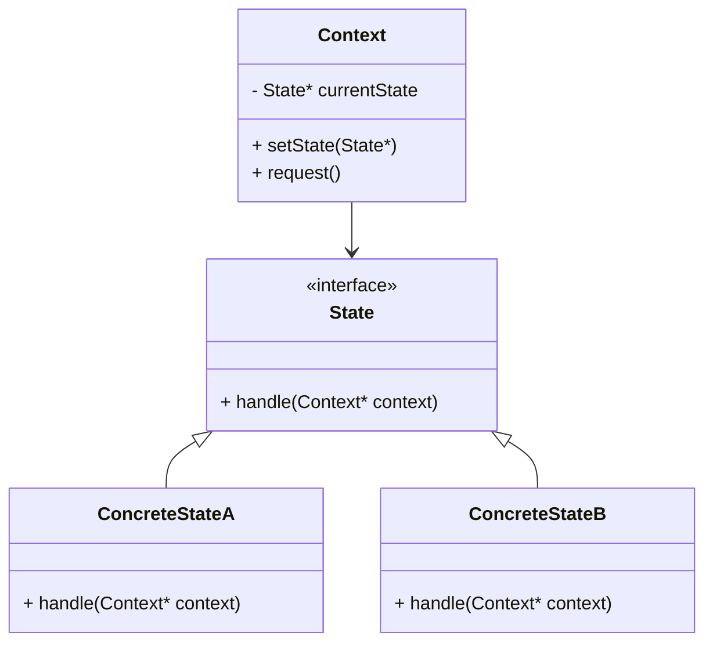
```mermaid
classDiagram
    class Context {
        - State* currentState
        + setState(State*)
        + request()
    }
    class State {
        <<interface>>
        + handle(Context* context)
    }
    class ConcreteStateA {
        + handle(Context* context)
    }
    class ConcreteStateB {
        + handle(Context* context)
    }

    Context --> State
    State <|-- ConcreteStateA
    State <|-- ConcreteStateB
```

<div style="page-break-after: always;"></div>

```cpp
#include <iostream> #include <memory>

class State; // Forward declaration

// Context
class TrafficLight {
private:
    std::shared_ptr<State> currentState;
public:
    void setState(std::shared_ptr<State> newState);
    void change();
};

// State Interface
class State {
public:
    virtual ~State() {}
    virtual void handle(TrafficLight& light) = 0;
};

// Concrete States
class RedState : public State {
public:
    void handle(TrafficLight& light) override;
};

class GreenState : public State {
public:
    void handle(TrafficLight& light) override;
};

class YellowState : public State {
public:
    void handle(TrafficLight& light) override;
};

void TrafficLight::setState(std::shared_ptr<State> newState) {
    currentState = newState;
}

void TrafficLight::change() {
    if (currentState) {
        currentState->handle(*this);
    }
}

void RedState::handle(TrafficLight& light) {
    std::cout << "Red -> Green" << std::endl;
    light.setState(std::make_shared<GreenState>());
}
void GreenState::handle(TrafficLight& light) {
    std::cout << "Green -> Yellow" << std::endl;
    light.setState(std::make_shared<YellowState>());
}
void YellowState::handle(TrafficLight& light) {
    std::cout << "Yellow -> Red" << std::endl;
    light.setState(std::make_shared<RedState>());
}

int main() {
    TrafficLight light;
    light.setState(std::make_shared<RedState>());
    
    light.change(); // Red -> Green
    light.change(); // Green -> Yellow
    light.change(); // Yellow -> Red
    light.change(); // Red -> Green (cycle continues)
    return 0;}
```

<div style="page-break-after: always;"></div>

---

## Pattern B9: Strategy

### Concept
Defines a family of algorithms, encapsulates each one, and makes them interchangeable. Strategy lets the algorithm vary independently from clients.

### Real-World Analogy
- **Navigation App**: You can choose different “strategies” to get from A to B (fastest route, shortest route, scenic route), and swap them at runtime.

### Use Case
- Sorting with multiple algorithms (QuickSort, MergeSort).
- Payment methods in an e-commerce system (credit card, PayPal, crypto).

### C++ Concepts Demonstrated
- **Polymorphism**: Different strategy implementations for the same task.
- **Encapsulation**: Each strategy details its own algorithm.

### UML Diagram
```mermaid
classDiagram
    class Context {
        - Strategy strategy
        + setStrategy(Strategy)
        + executeStrategy()
    }
    class Strategy {
        <<interface>>
        + doOperation(a, b)
    }
    class ConcreteStrategyA {
        + doOperation(a, b)
    }
    class ConcreteStrategyB {
        + doOperation(a, b)
    }

    Context --> Strategy
    Strategy <|-- ConcreteStrategyA
    Strategy <|-- ConcreteStrategyB
```

<div style="page-break-after: always;"></div>

### C++ Example
```cpp
#include <iostream>
#include <memory>

class SortingStrategy {
public:
    virtual ~SortingStrategy() {}
    virtual void sort() = 0;
};

class QuickSort : public SortingStrategy {
public:
    void sort() override {
        std::cout << "Sorting using QuickSort." << std::endl;
        // Implementation details...
    }
};

class MergeSort : public SortingStrategy {
public:
    void sort() override {
        std::cout << "Sorting using MergeSort." << std::endl;
        // Implementation details...
    }
};

// Context
class SortContext {
private:
    std::shared_ptr<SortingStrategy> strategy;
public:
    void setStrategy(std::shared_ptr<SortingStrategy> strat) {
        strategy = strat;
    }
    void executeSort() {
        if (strategy) {
            strategy->sort();
        }
    }
};

// Client
int main() {
    SortContext context;
    context.setStrategy(std::make_shared<QuickSort>());
    context.executeSort();

    context.setStrategy(std::make_shared<MergeSort>());
    context.executeSort();

    return 0;
}
```

<div style="page-break-after: always;"></div>

---

## Pattern B10: Template Method

### Concept
Defines the **skeleton** of an algorithm in a method, deferring some steps to subclasses. Template Method lets subclasses redefine certain steps of an algorithm without changing its structure.

### Real-World Analogy
- **Travel Agency**: The overall trip outline is the same (booking flight, hotel, tours), but specific details differ for each type of package.

### Use Case
- Multiple classes that do similar tasks with small differences in certain steps.
- Frameworks that define a broad process but let implementers fill specific steps.

### C++ Concepts Demonstrated
- **Inheritance**: Abstract base class with a “template” method.
- **Polymorphism**: Subclasses override specific steps.

### UML Diagram
```mermaid
classDiagram
    class AbstractClass {
        + templateMethod()
        - primitiveOperation1()
        - primitiveOperation2()
    }
    class ConcreteClass {
        - primitiveOperation1()
        - primitiveOperation2()
    }

    AbstractClass <|-- ConcreteClass
```

<div style="page-break-after: always;"></div>

### C++ Example
```cpp
#include <iostream>

class Game {
public:
    // Template Method
    void play() {
        startGame();
        playTurn();
        endGame();
    }

protected:
    virtual void startGame() = 0;
    virtual void playTurn() = 0;
    virtual void endGame() = 0;
};

class Chess : public Game {
protected:
    void startGame() override {
        std::cout << "Setting up a Chess board." << std::endl;
    }
    void playTurn() override {
        std::cout << "Playing a Chess move." << std::endl;
    }
    void endGame() override {
        std::cout << "Checkmate or Draw." << std::endl;
    }
};

int main() {
    Chess chess;
    chess.play();
    return 0;
}
```

<div style="page-break-after: always;"></div>

---

## Pattern B11: Visitor

### Concept
Represents an operation to be performed on the elements of an object structure. The Visitor lets you define a new operation without changing the classes of the elements.

### Real-World Analogy
- **Museum Tour Guide**: The museum has different types of exhibits (elements). The tour guide (visitor) “visits” each exhibit and performs an operation (explains or inspects) that may vary depending on the exhibit type.

### Use Case
- Complex class hierarchies where many distinct operations need to be performed on objects, but you don’t want to clutter the classes with these operations.
- Compilers (visiting different nodes in an Abstract Syntax Tree).

### C++ Concepts Demonstrated
- **Double Dispatch**: The visitor pattern uses `element->accept(visitor)`, then inside accept: `visitor->visitConcreteElement(this)`.
- **Encapsulation**: New operations are added via visitors, not by modifying the elements themselves.

### UML Diagram
```mermaid
classDiagram
    class Visitor {
        <<interface>>
        + visitConcreteElementA(ConcreteElementA)
        + visitConcreteElementB(ConcreteElementB)
    }
    class ConcreteVisitor1 {
        + visitConcreteElementA(ConcreteElementA)
        + visitConcreteElementB(ConcreteElementB)
    }
    class Element {
        <<interface>>
        + accept(Visitor)
    }
    class ConcreteElementA {
        + accept(Visitor)
        + operationA()
    }
    class ConcreteElementB {
        + accept(Visitor)
        + operationB()
    }

    Visitor <|-- ConcreteVisitor1
    Element <|-- ConcreteElementA
    Element <|-- ConcreteElementB
    ConcreteElementA --> Visitor : accept calls visitor
    ConcreteElementB --> Visitor : accept calls visitor
```

<div style="page-break-after: always;"></div>

### C++ Example
```cpp
#include <iostream> #include <vector> #include <memory>

// Forward declarations
class ConcreteElementA;
class ConcreteElementB;

// Visitor Interface
class Visitor {
public:
    virtual ~Visitor() {}
    virtual void visitConcreteElementA(ConcreteElementA* element) = 0;
    virtual void visitConcreteElementB(ConcreteElementB* element) = 0;
};

// Element Interface
class Element {
public:
    virtual ~Element() {}
    virtual void accept(Visitor* visitor) = 0;
};

// Concrete Elements
class ConcreteElementA : public Element {
public:
    void accept(Visitor* visitor) override {
        visitor->visitConcreteElementA(this);
    }
    void operationA() {
        std::cout << "ConcreteElementA operation." << std::endl;
    }
};

class ConcreteElementB : public Element {
public:
    void accept(Visitor* visitor) override {
        visitor->visitConcreteElementB(this);
    }
    void operationB() {
        std::cout << "ConcreteElementB operation." << std::endl;
    }
};

// Concrete Visitor
class ConcreteVisitor1 : public Visitor {
public:
    void visitConcreteElementA(ConcreteElementA* element) override {
        std::cout << "Visitor1 visiting ElementA." << std::endl;
        element->operationA();
    }
    void visitConcreteElementB(ConcreteElementB* element) override {
        std::cout << "Visitor1 visiting ElementB." << std::endl;
        element->operationB();
    }
};

int main() {
    std::vector<std::unique_ptr<Element>> elements;
    elements.push_back(std::make_unique<ConcreteElementA>());
    elements.push_back(std::make_unique<ConcreteElementB>());

    ConcreteVisitor1 visitor;
    for (auto& elem : elements) {
        elem->accept(&visitor);
    } return 0;}
```

---

# Final Reminders

1. **Real-World Analogy**: Helps you remember each pattern’s purpose.  
2. **Core C++ Concepts**: Notice how each pattern heavily leverages OOP principles—**inheritance**, **polymorphism**, **encapsulation**, **abstraction**, and sometimes **composition**.  
3. **Interview Tip**: Be ready to explain the **problem** each pattern solves and how it uses OOP concepts. Providing real-world analogies often helps demonstrate clear understanding.  

Good luck with your **Design Patterns** interview prep!